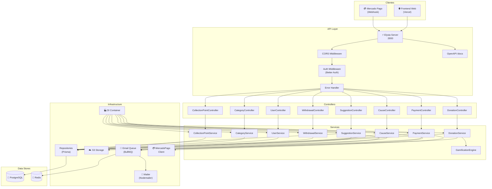
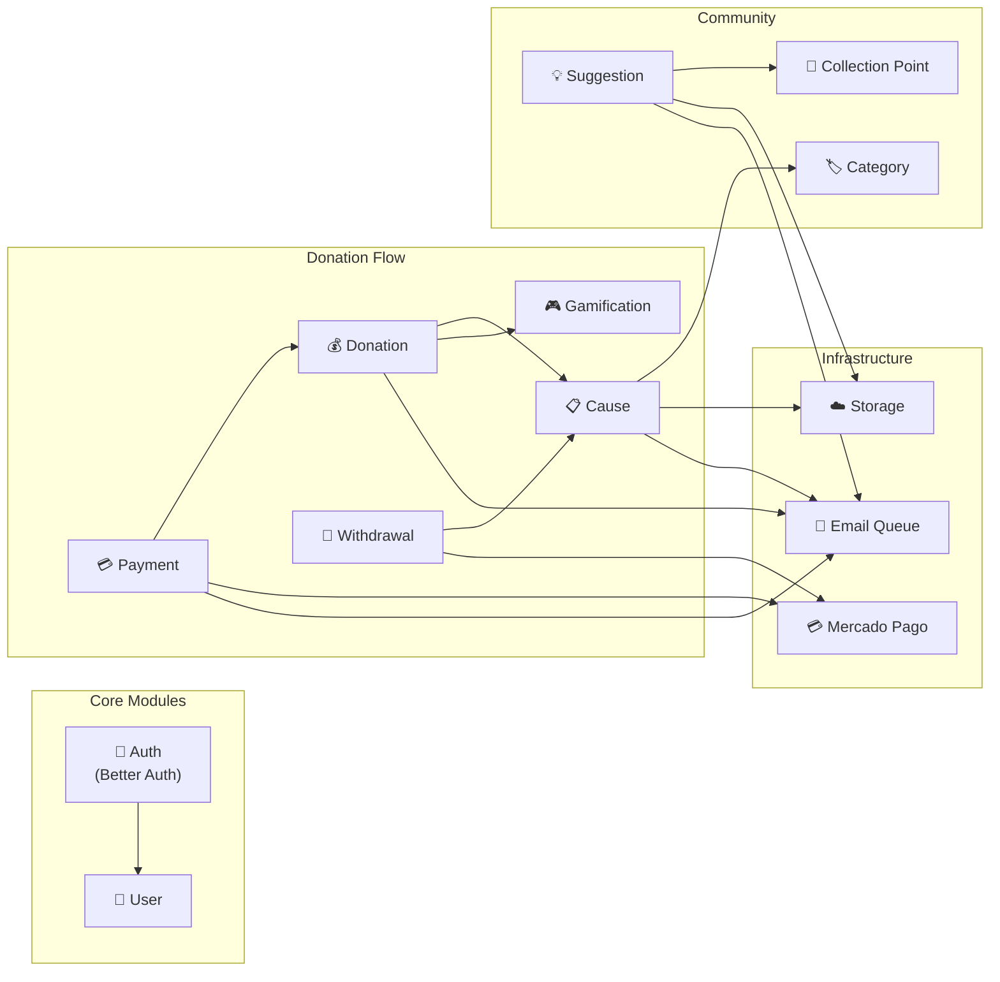
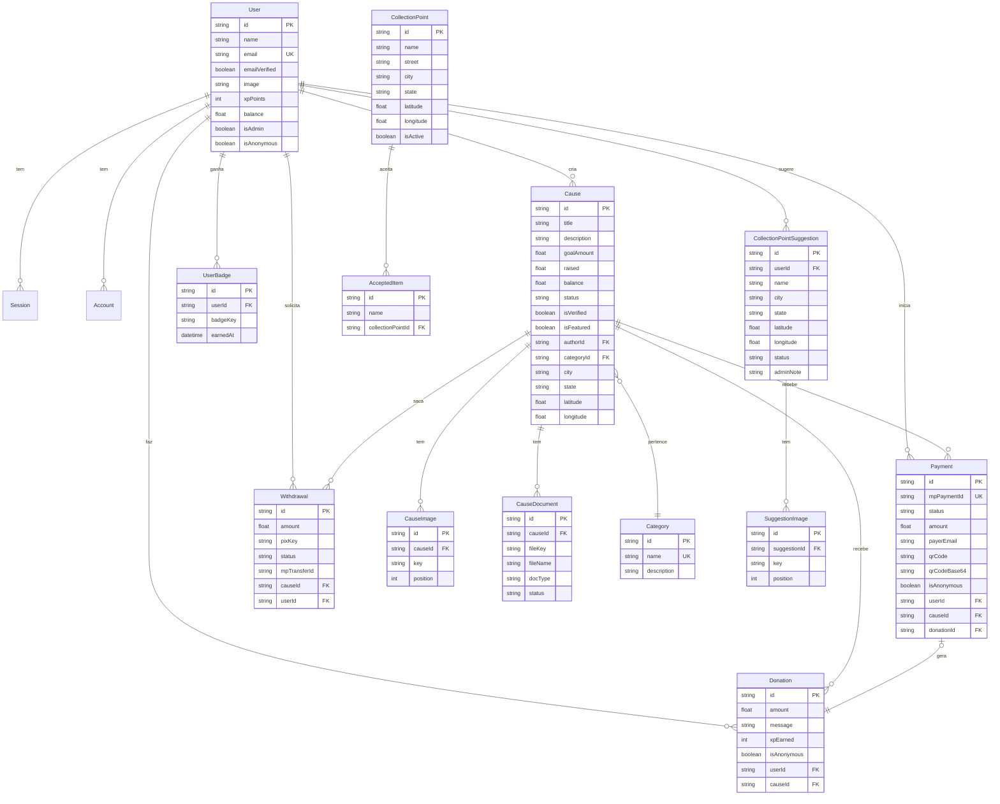
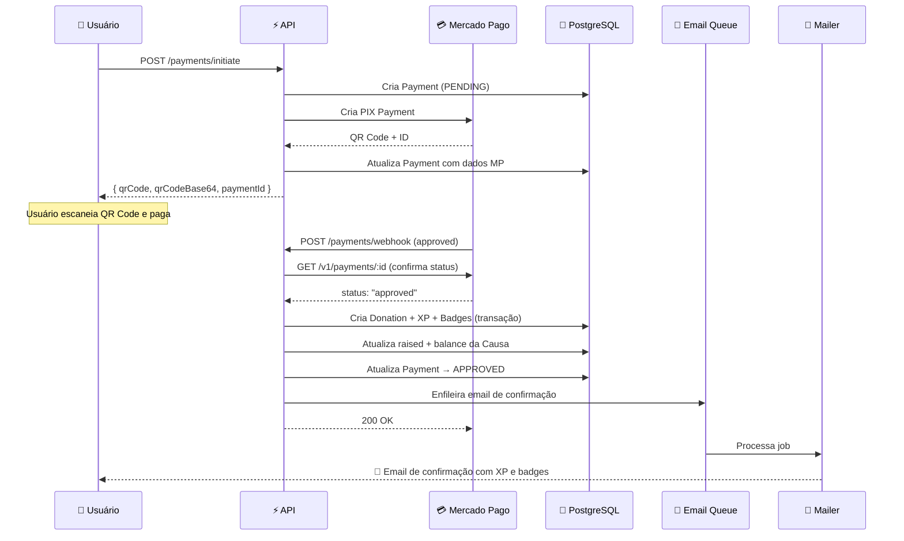
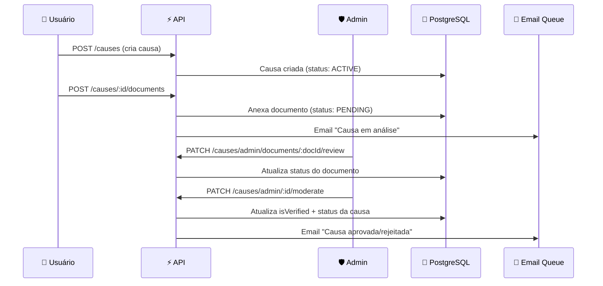
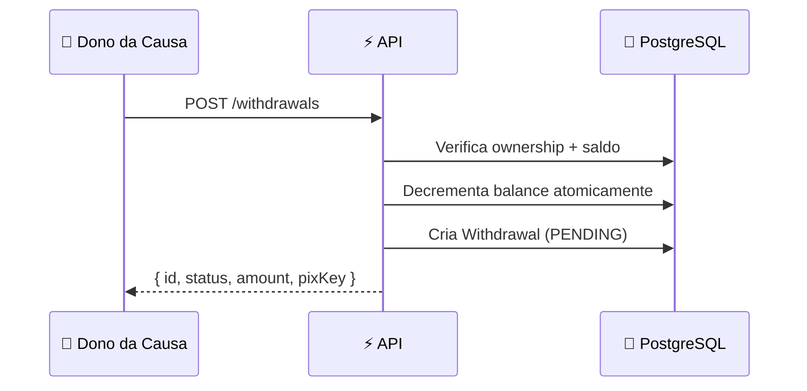

<p align="center">
  
  
  
  
  
  
</p>

# 🤝 API de Doações Gamificadas

> Plataforma backend de caridade com sistema de **XP**, **badges**, **leaderboard**, pagamentos via **PIX (Mercado Pago)** e causas verificadas por moderação administrativa.

---

## 📑 Índice

- [Visão Geral](#-visão-geral)
- [Arquitetura](#-arquitetura)
- [Stack Tecnológica](#-stack-tecnológica)
- [Módulos do Sistema](#-módulos-do-sistema)
- [Diagrama de Banco de Dados](#-diagrama-de-banco-de-dados)
- [Fluxos Principais](#-fluxos-principais)
- [Sistema de Gamificação](#-sistema-de-gamificação)
- [Endpoints da API](#-endpoints-da-api)
- [Emails Transacionais](#-emails-transacionais)
- [Setup Local](#-setup-local)
- [Docker](#-docker)
- [Variáveis de Ambiente](#-variáveis-de-ambiente)
- [Scripts Úteis](#-scripts-úteis)

---

## 🌍 Visão Geral

Esta API é o backend de uma plataforma de doações que conecta **doadores** a **causas sociais** verificadas. O diferencial é a camada de **gamificação**: cada doação concede **XP**, desbloqueando **níveis** e **badges**. Os doadores competem em um **leaderboard** global, incentivando a solidariedade de forma engajante.

### Principais funcionalidades

| Funcionalidade | Descrição |
|---|---|
| **Causas com moderação** | Criação, documentos de verificação e aprovação por admin |
| **Doações gamificadas** | XP, badges e leaderboard por doação |
| **Pagamento PIX** | Integração completa com Mercado Pago (QR Code + Webhook) |
| **Saques via PIX** | Donos de causas sacam o saldo arrecadado |
| **Pontos de coleta** | Cadastro de locais físicos para doações presenciais |
| **Sugestões comunitárias** | Usuários sugerem novos pontos de coleta |
| **Autenticação robusta** | Email/senha com OTP, Google OAuth, sessões seguras |
| **Emails transacionais** | Templates React renderizados e enviados via fila assíncrona |
| **Busca geográfica** | Filtro por coordenadas + raio para causas e pontos de coleta |

---

## 🏗 Arquitetura

A aplicação segue uma arquitetura em camadas com **Dependency Injection** manual via container:



### Estrutura de Pastas

```
backend/
├── prisma/
│   ├── schema.prisma          # Esquema do banco de dados
│   ├── migrations/            # Migrações SQL
│   └── seed-*.ts              # Scripts de seed
├── src/
│   ├── index.ts               # Bootstrap da aplicação
│   ├── auth.ts                # Configuração Better Auth
│   ├── container.ts           # Dependency Injection container
│   ├── modules/
│   │   ├── cause/             # Causas (CRUD + moderação + docs)
│   │   ├── donation/          # Doações + gamificação
│   │   ├── payment/           # Pagamentos PIX (Mercado Pago)
│   │   ├── withdrawal/        # Saques via PIX
│   │   ├── user/              # Perfil do usuário
│   │   ├── category/          # Categorias de causas
│   │   └── collection-points/ # Pontos de coleta + sugestões
│   ├── emails/                # Templates React Email
│   ├── jobs/                  # Workers BullMQ (email, payments)
│   ├── lib/                   # Integrações (Prisma, S3, MP, Mailer, BullMQ)
│   ├── errors/                # Classes de erro + códigos
│   ├── middleware/            # Auth middleware
│   └── plugins/               # Error handler plugin
├── docker-compose.yml         # PostgreSQL + Redis + API
├── Dockerfile                 # Multi-stage build com Bun
└── package.json
```

---

## 🛠 Stack Tecnológica

| Tecnologia | Uso |
|---|---|
| **[Bun](https://bun.sh)** | Runtime JavaScript ultrarrápido |
| **[Elysia](https://elysiajs.com)** | Framework HTTP com tipagem end-to-end |
| **[Prisma 7](https://prisma.io)** | ORM com runtime Bun e PostgreSQL |
| **[Better Auth](https://better-auth.com)** | Autenticação (email/senha, Google OAuth, OTP) |
| **[BullMQ](https://bullmq.io)** | Fila de jobs assíncronos (emails, pagamentos) |
| **[React Email](https://react.email)** | Templates de email renderizados server-side |
| **[Mercado Pago SDK](https://www.mercadopago.com.br/developers)** | Pagamentos PIX e transferências |
| **[Bun S3 Client](https://bun.sh/docs/api/s3)** | Upload de imagens/documentos (S3/R2 compatível) |
| **[Nodemailer](https://nodemailer.com)** | Envio de emails via SMTP |
| **PostgreSQL 15** | Banco de dados relacional |
| **Redis 7** | Broker de filas do BullMQ |
| **Docker** | Containerização e orquestração |

---

## 📦 Módulos do Sistema



### Cada módulo segue o padrão:

```
module/
├── module.controller.ts   # Rotas HTTP (Elysia plugin)
├── module.service.ts      # Lógica de negócio
├── module.repository.ts   # Acesso ao banco (Prisma)
├── module.schema.ts       # Validação de entrada (Typebox)
└── module.types.ts        # Interfaces e tipos TypeScript
```

---

## 🗄 Diagrama de Banco de Dados



---

## 🔄 Fluxos Principais

### Fluxo de Doação via PIX



### Fluxo de Moderação de Causas



### Fluxo de Saque



---

## 🎮 Sistema de Gamificação

### Níveis

| Nível | Nome | XP Mínimo |
|:---:|---|---:|
| 1 | 🌱 Semente | 0 |
| 2 | 🌿 Broto | 100 |
| 3 | 🌳 Planta | 300 |
| 4 | 🌲 Árvore | 700 |
| 5 | 🌳🌳 Floresta | 1.500 |
| 6 | 🛡 Guardião | 3.000 |
| 7 | 🦸 Herói | 5.000 |

### Cálculo de XP

```
XP = max(1, floor(valor_doação_em_reais))

Bônus por marcos:
  • 1ª doação  → +50 XP
  • 5ª doação  → +20 XP
  • 10ª doação → +30 XP
  • 20ª doação → +50 XP
```

### Badges (Emblemas)

| Badge | Nome | Condição | Ícone |
|---|---|---|:---:|
| `FIRST_DONATION` | Primeiro Passo | 1ª doação realizada | 🌱 |
| `DONOR_5` | Doador Frequente | 5 doações | 💚 |
| `DONOR_10` | Generoso | 10 doações | 💛 |
| `DONOR_20` | Filantropo | 20 doações | 🏆 |
| `TOTAL_500` | Grande Doador | R$ 500 doados no total | ⭐ |
| `TOTAL_1000` | Herói da Comunidade | R$ 1.000 doados no total | 🦸 |

> **Nota:** Doações anônimas (`isAnonymous: true`) **não concedem** XP nem badges.

---

## 📡 Endpoints da API

A documentação interativa OpenAPI está disponível em `/docs` (protegida por Basic Auth).

### 🔐 Autenticação (Better Auth)

| Método | Rota | Descrição |
|---|---|---|
| `POST` | `/api/sign-up/email` | Cadastro com email/senha |
| `POST` | `/api/sign-in/email` | Login com email/senha |
| `POST` | `/api/sign-in/social` | Login via Google OAuth |
| `POST` | `/api/email-otp/send-verification-otp` | Enviar OTP de verificação |
| `POST` | `/api/email-otp/verify-email` | Verificar email com OTP |
| `POST` | `/api/forget-password` | Solicitar reset de senha |

---

### 📋 Causas — `/causes`

| Método | Rota | Auth | Descrição |
|---|---|:---:|---|
| `GET` | `/causes` | ❌ | Listar causas ativas com filtros |
| `GET` | `/causes/:id` | ❌ | Buscar causa por ID |
| `POST` | `/causes` | ✅ | Criar nova causa |
| `PATCH` | `/causes/:id` | ✅ | Atualizar causa (autor) |
| `DELETE` | `/causes/:id` | ✅ | Deletar causa (autor) |
| `POST` | `/causes/:id/documents` | ✅ | Anexar documento de verificação |
| `GET` | `/causes/:id/documents` | ✅ | Listar documentos da causa |
| `GET` | `/causes/admin/pending` | ✅🛡 | Listar causas pendentes (admin) |
| `PATCH` | `/causes/admin/:id/moderate` | ✅🛡 | Moderar causa (admin) |
| `PATCH` | `/causes/admin/documents/:docId/review` | ✅🛡 | Aprovar/rejeitar documento (admin) |

**Filtros disponíveis em `GET /causes`:**

| Parâmetro | Tipo | Descrição |
|---|---|---|
| `sort` | `string` | `recent` · `most_popular` · `most_urgent` · `nearest` |
| `city` | `string` | Filtro parcial por cidade |
| `state` | `string` | Filtro parcial por estado |
| `lat` | `number` | Latitude do usuário |
| `lng` | `number` | Longitude do usuário |
| `radius` | `number` | Raio em km (padrão: 50) |
| `categoryId` | `string` | Filtrar por categoria |
| `search` | `string` | Busca textual |
| `skip` / `take` | `number` | Paginação |

---

### 💰 Doações — `/donations`

| Método | Rota | Auth | Descrição |
|---|---|:---:|---|
| `POST` | `/donations` | ✅ | Fazer uma doação direta |
| `GET` | `/donations/me` | ✅ | Meu histórico de doações |
| `GET` | `/donations/:id` | ❌ | Buscar doação por ID |
| `GET` | `/donations/cause/:causeId` | ❌ | Doações de uma causa |
| `GET` | `/donations/leaderboard` | ❌ | Top doadores por XP |

---

### 💳 Pagamentos — `/payments`

| Método | Rota | Auth | Descrição |
|---|---|:---:|---|
| `POST` | `/payments/initiate` | ✅ | Iniciar pagamento PIX |
| `POST` | `/payments/webhook` | ❌ | Webhook do Mercado Pago |
| `GET` | `/payments/:id` | ❌ | Buscar pagamento por ID |
| `GET` | `/payments/me` | ✅ | Meus pagamentos |
| `GET` | `/payments/cause/:causeId` | ❌ | Pagamentos de uma causa |

---

### 🏦 Saques — `/withdrawals`

| Método | Rota | Auth | Descrição |
|---|---|:---:|---|
| `POST` | `/withdrawals` | ✅ | Solicitar saque via PIX |
| `GET` | `/withdrawals/me` | ✅ | Meus saques |
| `GET` | `/withdrawals/:id` | ❌ | Buscar saque por ID |
| `GET` | `/withdrawals/cause/:causeId` | ✅ | Saques de uma causa (dono) |

---

### 👤 Usuários — `/users`

| Método | Rota | Auth | Descrição |
|---|---|:---:|---|
| `GET` | `/users/:id` | ❌ | Buscar usuário por ID |
| `GET` | `/users/me` | ✅ | Meu perfil básico |
| `GET` | `/users/me/profile` | ✅ | Perfil completo (causas + doações) |
| `PATCH` | `/users/me` | ✅ | Atualizar perfil (nome, avatar) |

---

### 🏷 Categorias — `/categories`

| Método | Rota | Auth | Descrição |
|---|---|:---:|---|
| `GET` | `/categories` | ❌ | Listar categorias |
| `POST` | `/categories` | ✅🛡 | Criar categoria (admin) |

---

### 📍 Pontos de Coleta — `/collection-points`

| Método | Rota | Auth | Descrição |
|---|---|:---:|---|
| `GET` | `/collection-points` | ❌ | Listar pontos ativos com filtros |
| `GET` | `/collection-points/:id` | ❌ | Buscar ponto por ID |
| `GET` | `/collection-points/admin/all` | ✅🛡 | Listar todos (admin) |
| `POST` | `/collection-points` | ✅🛡 | Criar ponto (admin) |
| `PATCH` | `/collection-points/:id` | ✅🛡 | Atualizar ponto (admin) |
| `DELETE` | `/collection-points/:id` | ✅🛡 | Deletar ponto (admin) |

---

### 💡 Sugestões de Pontos — `/suggestions`

| Método | Rota | Auth | Descrição |
|---|---|:---:|---|
| `POST` | `/suggestions` | ✅ | Sugerir novo ponto de coleta |
| `GET` | `/suggestions/me` | ✅ | Minhas sugestões |
| `GET` | `/suggestions/admin/pending` | ✅🛡 | Sugestões pendentes (admin) |
| `PATCH` | `/suggestions/admin/:id/review` | ✅🛡 | Aprovar/rejeitar sugestão (admin) |

---

## 📧 Emails Transacionais

Todos os emails são processados via **BullMQ** (Redis) com retry automático (3 tentativas, backoff exponencial). Os templates são renderizados server-side com **React Email**.

| Tipo | Template | Trigger |
|---|---|---|
| 📧 OTP | `otp.tsx` | Verificação de email / Reset de senha |
| ✅ Confirmação de doação | `donation-confirmation.tsx` | Doação aprovada (via webhook) |
| ❌ Pagamento falhou | `payment-failed.tsx` | Webhook do MP com status rejeitado/cancelado |
| 📝 Causa em análise | `cause-under-review.tsx` | Documento anexado à causa |
| 🎉 Causa aprovada | `cause-approval.tsx` | Admin aprova a causa |
| 📍 Sugestão analisada | `suggestion-reviewed.tsx` | Admin revisa sugestão de ponto de coleta |

---

## 🚀 Setup Local

### Pré-requisitos

- **[Bun](https://bun.sh)** ≥ 1.x
- **PostgreSQL** 15+
- **Redis** 7+
- Conta no **Mercado Pago** (para pagamentos)
- Bucket **S3-compatível** (ex: Cloudflare R2, AWS S3, MinIO)

### 1. Clonar e instalar

```bash
git clone https://github.com/seu-usuario/backend.git
cd backend
bun install
```

### 2. Configurar variáveis de ambiente

```bash
cp .env.example .env
# Edite o .env com suas credenciais
```

### 3. Rodar migrações e gerar o Prisma Client

```bash
bunx prisma migrate dev
bunx prisma generate
```

### 4. (Opcional) Popular o banco com dados de teste

```bash
bun run prisma/seed-categories.ts
bun run prisma/seed-user.ts
bun run prisma/seed-causes.ts
bun run prisma/seed-collection-points.ts
bun run prisma/seed-suggestions.ts
```

### 5. Iniciar o servidor

```bash
bun run dev
```

O servidor estará disponível em `http://localhost:3000`.  
A documentação OpenAPI estará em `http://localhost:3000/docs`.

---

## 🐳 Docker

### Subir tudo com Docker Compose

```bash
docker compose up -d
```

Isso inicia 3 containers:

| Container | Porta | Descrição |
|---|---|---|
| `doacao_postgres` | 5432 | PostgreSQL 15 Alpine |
| `doacao_redis` | 6379 | Redis 7 Alpine (AOF) |
| `doacao_api` | 3000 | API (Bun + Elysia) |

### Build manual da imagem

```bash
docker build -t doacao-api .
```

O Dockerfile usa **multi-stage build**:
1. **Stage 1 (builder):** Instala deps + gera Prisma Client
2. **Stage 2 (production):** Copia artefatos, roda migrações no startup e inicia a aplicação

> Para mais detalhes sobre o Docker, consulte o [Docker-README.md](./Docker-README.md).

---

## 🔐 Variáveis de Ambiente

| Variável | Obrigatória | Descrição |
|---|:---:|---|
| `DATABASE_URL` | ✅ | Connection string do PostgreSQL |
| `BETTER_AUTH_SECRET` | ✅ | Secret para tokens de sessão |
| `BETTER_AUTH_URL` | ✅ | URL base da autenticação |
| `SMTP_HOST` | ✅ | Host do servidor SMTP |
| `SMTP_PORT` | ✅ | Porta SMTP (587 para TLS) |
| `SMTP_USER` | ✅ | Usuário SMTP |
| `SMTP_PASS` | ✅ | Senha/app password SMTP |
| `S3_ENDPOINT` | ✅ | Endpoint do storage S3-compatível |
| `S3_REGION` | ✅ | Região do bucket |
| `S3_BUCKET` | ✅ | Nome do bucket |
| `S3_ACCESS_KEY_ID` | ✅ | Access key do S3 |
| `S3_SECRET_ACCESS_KEY` | ✅ | Secret key do S3 |
| `MERCADOPAGO_ACCESS_TOKEN` | ✅ | Token de acesso do Mercado Pago |
| `GOOGLE_CLIENT_ID` | ❌ | Client ID do Google OAuth |
| `GOOGLE_CLIENT_SECRET` | ❌ | Client Secret do Google OAuth |
| `REDIS_URL` | ❌ | URL do Redis (padrão: `redis://localhost:6379`) |
| `NODE_ENV` | ❌ | `development` ou `production` |
| `PORT` | ❌ | Porta do servidor (padrão: `3000`) |

---

## 📜 Scripts Úteis

```bash
# Desenvolvimento com hot-reload
bun run dev

# Gerar client Prisma
bunx prisma generate

# Rodar migrações
bunx prisma migrate dev

# Abrir Prisma Studio (GUI do banco)
bunx prisma studio

# Criar nova migração
bunx prisma migrate dev --name nome_da_migracao

# Docker compose
docker compose up -d      # Subir
docker compose down        # Derrubar
docker compose logs -f api # Ver logs da API
```

---

<p align="center">
  Feito com ❤️ para conectar doadores a causas que transformam vidas.
</p>
